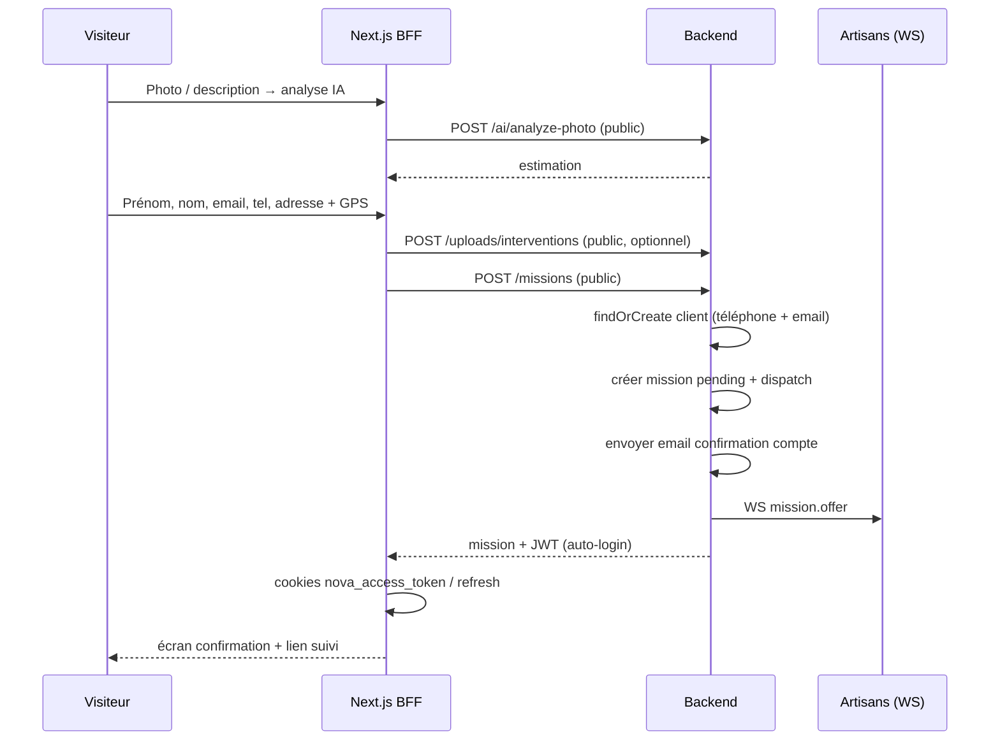

# Demande d'intervention sans compte (parcours invité)

Le frontend `/demander` permet désormais de **mandater un artisan sans inscription préalable**.  
Le compte client est créé **automatiquement à la soumission** avec prénom, nom, **email**, téléphone et adresse GPS.  
Un **email de confirmation de compte** est envoyé (lien de vérification + définition du mot de passe).

---

## Flux utilisateur



---

## Routes à rendre **publiques** (sans JWT)

| Méthode | Route backend | Rate-limit recommandé |
|---------|---------------|------------------------|
| GET | `/api/v1/ai/status` | 60/min/IP |
| POST | `/api/v1/ai/analyze-photo` | 10/min/IP |
| POST | `/api/v1/ai/analyze-text` | 10/min/IP |
| POST | `/api/v1/uploads/interventions` | 20/min/IP |
| POST | `/api/v1/missions` | 5/min/IP |

Si une route reste protégée, le parcours invité échouera avec `401`.

---

## POST `/api/v1/missions` — comportement invité

### Auth

- **Sans `Authorization`** : parcours invité (création compte + mission).
- **Avec JWT client** : comportement actuel (`customerId` = user du token).

### Corps JSON (camelCase)

```json
{
  "title": "Dépannage urgence",
  "description": "Fuite sous évier cuisine…",
  "category": "plomberie",
  "status": "pending",
  "customerFirstName": "Jean",
  "customerLastName": "Dupont",
  "customerName": "Jean Dupont",
  "customerEmail": "jean.dupont@email.com",
  "customerPhone": "+33612345678",
  "address": "12 rue de la Paix, 75002 Paris",
  "city": "Paris",
  "latitude": 48.8698,
  "longitude": 2.3314,
  "photoBeforeUrl": "https://res.cloudinary.com/.../before.jpg",
  "priceEstimate": 250,
  "priceMinEstimate": 150,
  "urgency": "urgent",
  "creationMode": "ai_photo",
  "aiConfidence": 0.85,
  "estimatedDurationMinutes": 45,
  "recommendedParts": ["Joint 40mm", "Siphon"]
}
```

### Champs obligatoires (invité)

| Champ | Règle |
|-------|--------|
| `customerFirstName` | min 2 caractères |
| `customerLastName` | min 2 caractères |
| `customerEmail` | email valide, normalisé (minuscules) |
| `customerPhone` | E.164 ou FR 10 chiffres, normalisé |
| `address` | texte complet |
| `latitude` / `longitude` | obligatoires, France métropolitaine |
| `title` ou `category` | au moins l'un des deux |

### Logique métier backend

```typescript
async function createMission(req) {
  const userId = req.user?.id; // null si invité

  if (!userId) {
    const phone = normalizePhone(body.customerPhone);
    const email = normalizeEmail(body.customerEmail);

    // Vérifier conflit email ↔ téléphone (comptes existants)
    const existingByPhone = await db.users.findByPhone(phone);
    const existingByEmail = await db.users.findByEmail(email);
    if (
      existingByPhone &&
      existingByEmail &&
      existingByPhone.id !== existingByEmail.id
    ) {
      throw validationError(
        "EMAIL_PHONE_MISMATCH",
        "Cet email et ce téléphone sont associés à des comptes différents.",
      );
    }

    let user = existingByPhone ?? existingByEmail;
    let accountCreated = false;

    if (!user) {
      user = await db.users.create({
        role: "client",
        firstName: body.customerFirstName,
        lastName: body.customerLastName,
        phone,
        email,
        emailVerified: false,
        passwordHash: null,
        authProvider: "guest",
      });
      accountCreated = true;
    } else {
      await db.users.patchIfEmpty(user.id, {
        firstName: body.customerFirstName,
        lastName: body.customerLastName,
        phone: user.phone ?? phone,
        email: user.email ?? email,
      });
    }

    // Email de confirmation si compte nouveau OU email jamais vérifié
    if (accountCreated || !user.emailVerified) {
      await authService.sendVerificationEmail(user);
    }

    // 3. Profil / adresse par défaut
    await db.profiles.upsert({
      userId: user.id,
      firstName: body.customerFirstName,
      lastName: body.customerLastName,
      phone,
      address: body.address,
      city: body.city,
      latitude: body.latitude,
      longitude: body.longitude,
    });

    customerId = user.id;
  } else {
    customerId = userId;
    accountCreated = false;
  }

  // 4. Créer la mission (comme aujourd'hui)
  const mission = await db.missions.create({ ...body, customerId, status: "pending" });

  // 5. Dispatch artisans (rayon MISSION_SEARCH_RADIUS_KM)
  await dispatchMissionOffers(mission);

  // 6. Réponse invité : auto-login léger
  const tokens = accountCreated || !req.user
    ? await authService.issueTokens(user)
    : undefined;

  return {
    mission,
    accountCreated,
    accessToken: tokens?.accessToken,
    refreshToken: tokens?.refreshToken,
    user: sanitizeUser(user),
    profile: await db.profiles.findByUserId(user.id),
  };
}
```

### Réponse `201`

```json
{
  "mission": {
    "id": "uuid",
    "status": "pending",
    "customerId": "uuid",
    "customerName": "Jean Dupont",
    "customerPhone": "+33612345678",
    "customerEmail": "jean.dupont@email.com",
    "latitude": 48.8698,
    "longitude": 2.3314,
    "address": "12 rue de la Paix, 75002 Paris",
    "title": "Dépannage urgence",
    "priceEstimate": 250,
    "urgency": "urgent",
    "photoBeforeUrl": "https://...",
    "createdAt": "2026-06-08T10:00:00.000Z"
  },
  "accountCreated": true,
  "accessToken": "eyJ...",
  "refreshToken": "eyJ...",
  "user": {
    "id": "uuid",
    "role": "client",
    "firstName": "Jean",
    "lastName": "Dupont",
    "phone": "+33612345678",
    "email": "jean.dupont@email.com",
    "emailVerified": false,
    "hasPassword": false
  },
  "profile": {
    "firstName": "Jean",
    "lastName": "Dupont",
    "phone": "+33612345678",
    "address": "12 rue de la Paix, 75002 Paris",
    "latitude": 48.8698,
    "longitude": 2.3314
  }
}
```

Le BFF Next.js pose les cookies httpOnly si `accessToken` est présent → le client peut cliquer « Suivre ma demande » sans se reconnecter.

---

## Email de confirmation compte

Réutiliser le flux existant (`POST /auth/register` / `sendVerificationEmail`) :

| Événement | Email |
|-----------|--------|
| Compte invité créé | **Activation compte** — lien `…/verify-email?token=…` (formulaire mot de passe côté front) |
| Mission créée | *(optionnel P2)* **Récap demande** — n° mission, estimation, délai |

**Lien email invité :**

```
https://novaintervention.com/verify-email?token={uuid}
```

(Pas besoin de `setup=1` — le front affiche toujours le formulaire mot de passe sauf si `auto=1`.)

**Endpoint :** `POST /api/v1/auth/verify-email`

```json
{ "token": "uuid", "password": "minimum8chars" }
```

- Avec `password` : enregistre le mot de passe, `emailVerified = true`, compte activé.
- Sans `password` (inscription classique) : confirme l'email seulement.

**Objet suggéré :** « Activez votre compte Nova Intervention »

Variables SMTP : `EMAIL_FROM`, `SMTP_*` (déjà documentés dans `README_BACKEND.md`).

---

## Compte client « léger » — évolutions ultérieures

| Étape | Action |
|-------|--------|
| À la création | Compte avec email + téléphone, sans mot de passe |
| Email immédiat | Lien `verify-email?token=…` → choix du mot de passe + confirmation email |
| SMS (optionnel P1) | Lien de suivi mission par SMS en complément |
| Plus tard | Connexion email/mot de passe ou SMS |

---

## Erreurs

| Code | HTTP | Cas |
|------|------|-----|
| `VALIDATION_ERROR` | 400 | champs manquants, GPS absent |
| `INVALID_EMAIL` | 400 | email invalide |
| `EMAIL_PHONE_MISMATCH` | 409 | email et téléphone rattachés à deux comptes |
| `INVALID_PHONE` | 400 | téléphone invalide |
| `RATE_LIMITED` | 429 | trop de demandes / IP |
| `DATABASE_UNAVAILABLE` | 503 | DB down |

---

## Migration SQL (si colonnes manquantes)

```sql
ALTER TABLE users
  ALTER COLUMN email DROP NOT NULL,
  ALTER COLUMN password_hash DROP NOT NULL;

ALTER TABLE users
  ADD COLUMN IF NOT EXISTS auth_provider VARCHAR(32) DEFAULT 'email';

CREATE UNIQUE INDEX IF NOT EXISTS users_phone_unique
  ON users (phone)
  WHERE phone IS NOT NULL AND deleted_at IS NULL;
```

---

## Checklist backend

- [ ] `POST /missions` accepte les requêtes **sans JWT**
- [ ] `customerEmail` obligatoire en mode invité
- [ ] `findOrCreate` client par `phone` **ou** `email` (gestion conflit)
- [ ] Lien email invité : `…/verify-email?token={uuid}`
- [ ] `POST /auth/verify-email` accepte `{ token, password }` (confirme email + enregistre mot de passe)
- [ ] Si email déjà vérifié : accepter `{ token, password }` via `reset-password` ou même endpoint
- [ ] Réponse avec `mission` + `accessToken` + `refreshToken` + `accountCreated`
- [ ] Routes IA + upload **publiques** (rate-limit)
- [ ] Dispatch WS `mission.offer` inchangé
- [ ] CORS : origine `https://novaintervention.com`

---

## Test curl

```bash
curl -X POST http://localhost:4000/api/v1/missions \
  -H "Content-Type: application/json" \
  -d '{
    "title": "Fuite évier",
    "customerFirstName": "Jean",
    "customerLastName": "Dupont",
    "customerEmail": "jean.dupont@email.com",
    "customerPhone": "0612345678",
    "address": "12 rue de la Paix, 75002 Paris",
    "city": "Paris",
    "latitude": 48.8698,
    "longitude": 2.3314,
    "description": "Fuite sous évier",
    "urgency": "urgent",
    "priceEstimate": 200
  }'
```

Réponse attendue : `201` + `mission.id` + tokens JWT.

---

## Fichiers frontend modifiés

| Fichier | Rôle |
|---------|------|
| `app/demander/page.tsx` | Parcours sans login, prénom/nom, confirmation |
| `components/demander/DemanderCoordinatesStep.tsx` | Formulaire invité |
| `app/api/missions/route.ts` | POST public + auto-login cookies |
| `app/api/ai/*` | Analyse IA publique |
| `app/api/uploads/interventions/route.ts` | Upload sans auth |
| `lib/api/mappers.ts` | `customerFirstName`, `customerLastName` |
